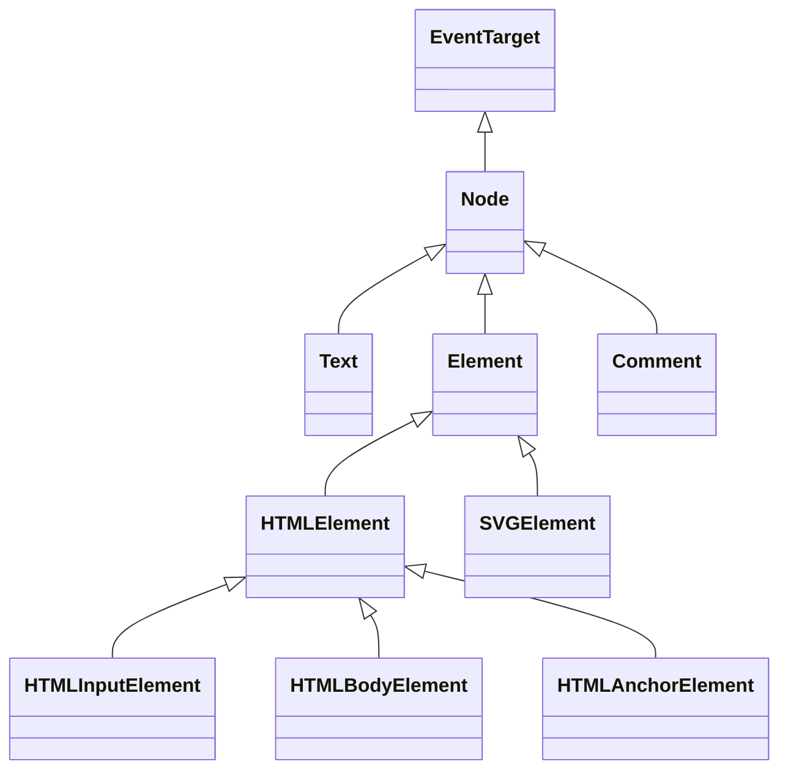

### 一、 `Dom`树

#### 1.1 `Dom`节点类型

每个树的节点都是一个对象。

标签被称为 **元素节点**（或者仅仅是元素），并形成了树状结构：`<html>` 在根节点，`<head>` 和 `<body>` 是其子项，等。

元素内的文本形成 **文本节点**，被标记为 `＃text`。一个文本节点只包含一个字符串。它没有子项，并且总是树的叶子。

例如，`<title>` 标签里面有文本 `"About elk"`。

请注意文本节点中的特殊字符：

- 换行符：`↵`（在 JavaScript 中为 `\n`）
- 空格：`␣`

空格和换行符都是完全有效的字符，就像字母和数字。它们形成文本节点并成为 DOM 的一部分。所以，例如，在上面的示例中，`<head>` 标签中的 `<title>` 标签前面包含了一些空格，并且该文本变成了一个 `#text` 节点（它只包含一个换行符和一些空格）。

只有两个顶级排除项：

1. 由于历史原因，`<head>` 之前的空格和换行符均被忽略。
2. 如果在 `</body>` 之后放置一些东西，那么它会被自动移动到 `body` 内，并处于 `body` 中的最下方，因为 HTML 规范要求所有内容必须位于 `<body>` 内。所以 `</body>` 之后不能有空格。

在其他情况下，一切都很简单 — 如果文档中有空格（就像任何字符一样），那么它们将成为 DOM 中的文本节点，而如果删除它们，则不会有任何空格。

**字符串开头/结尾处的空格，以及只有空格的文本节点，通常会被工具隐藏**

与 DOM 一起使用的浏览器工具（即将介绍）通常不会在文本的开始/结尾显示空格，并且在标签之间也不会显示空文本节点（换行符）。开发者工具通过这种方式节省屏幕空间。

#### 1.2 自动修正

如果浏览器遇到格式不正确的 HTML，它会在形成 DOM 时自动更正它。例如，顶级标签总是 `<html>`。即使它不存在于文档中 — 它也会出现在 DOM 中，因为浏览器会创建它。对于 `<body>` 也是一样。

例如，如果一个 HTML 文件中只有一个单词 “Hello”，浏览器则会把它包装到 `<html>` 和 `<body>` 中，并且会添加所需的 `<head>`

在生成 DOM 时，浏览器会自动处理文档中的错误，关闭标签等。一个没有关闭标签的文档，将成为一个正常的 DOM，因为浏览器在读取标签时会填补缺失的部分。

**表格永远有 `<tbody>`**

表格是一个有趣的“特殊的例子”。按照 DOM 规范，它们必须具有 `<tbody>`，但 HTML 文本却（官方的）忽略了它。然后浏览器在创建 DOM 时，自动地创建了 `<tbody>`。

#### 1.3 其他节点类型

除了元素和文本节点外，还有一些其他的节点类型。例如，注释。

**HTML 中的所有内容，甚至注释，都会成为 DOM 的一部分。**

甚至 HTML 开头的 `<!DOCTYPE...>` 指令也是一个 DOM 节点。它在 DOM 树中位于 `<html>` 之前。我们不会触及那个节点，出于这个原因，我们甚至不会在图表中绘制它，但它确实就在那里。

表示整个文档的 `document` 对象，在形式上也是一个 DOM 节点。

一共有 [12 种节点类型](https://dom.spec.whatwg.org/#node)。实际上，通常用到的是其中的 4 种：

1. `document` — DOM 的“入口点”。
2. 元素节点 — HTML 标签，树构建块。
3. 文本节点 — 包含文本。
4. 注释 — 有时我们可以将一些信息放入其中，它不会显示，但 JS 可以从 DOM 中读取它。

#### 1.4 与控制台交互

在处理 DOM 时可能还希望对其应用 `JavaScript`。例如：获取一个节点并运行一些代码来修改它，以查看结果。以下是在元素（Elements）选项卡和控制台（Console）之间切换的一些技巧。

首先：

- 在元素（Elements）选项卡中选择第一个 `<li>`。
- 按下 Esc — 它将在元素（Elements）选项卡下方打开控制台（Console）。

现在最后选中的元素可以通过 `$0` 来进行操作，先前选择的是 `$1`，等。可以对它们执行一些命令。例如，`$0.style.background = 'red'` 使选定的列表项（list item）变成红色

这就是在控制台（Console）中获取元素（Elements）选项卡中的节点的方法。

还有一种方式。如果存在引用 DOM 节点的变量，那么我们可以在控制台（Console）中使用命令 `inspect(node)`，`node`为引用节点的变量，来在元素（Elements）选项卡中查看它。

或者可以直接在控制台（Console）中输出 DOM 节点，并“就地”探索它，例如 `document.body`：

```javascript
// in Console
document.body

// 会打印以body为根节点的Dom树
```

### 二、 遍历`Dom`

对 `DOM` 的所有操作都是以 `document` 对象开始。它是 DOM 的主“入口点”。从它移动可以访问到任何节点。

#### 2.1 在最顶层：`documentElement`和`body`

最顶层的树节点可以直接作为 `document` 的属性来使用：

- `<html>` = `document.documentElement`

  最顶层的 document 节点是 `document.documentElement`。这是对应 `<html>` 标签的 DOM 节点。

- `<body>` = `document.body`

  另一个被广泛使用的 DOM 节点是 `<body>` 元素 — `document.body`。

  **`document.body` 的值可能是 `null`**

  脚本无法访问在运行时不存在的元素。

  尤其是，如果一个脚本是在 `<head>` 中，那么脚本是访问不到 `document.body` 元素的，因为浏览器还没有读到它。在 `DOM` 中，`null` 值就意味着“不存在”或者“没有这个节点”。

- `<head>` = `document.head`

  `<head>` 标签可以通过 `document.head` 访问。

#### 2.2 子节点：`childNodes`，`firstChild`，`lastChild`

- **子节点（或者叫作子）** — 对应的是直系的子元素。换句话说，它们被完全嵌套在给定的元素中。例如，`<head>` 和 `<body>` 就是 `<html>` 元素的子元素。
- **子孙元素** — 嵌套在给定元素中的所有元素，包括子元素，以及子元素的子元素等。

**`childNodes` 集合会列出所有子节点，包括文本节点。**

**`firstChild` 和 `lastChild` 属性是访问第一个和最后一个子元素的快捷方式。**

它们只是简写。如果元素存在子节点，那么下面的脚本运行结果将是 `true`：

```javascript
elem.childNodes[0] === elem.firstChild
elem.childNodes[elem.childNodes.length - 1] === elem.lastChild
```

这里还有一个特别的函数 `elem.hasChildNodes()` 用于检查节点是否有子节点。

#### 2.3 `DOM`集合

`childNodes` 看起来就像一个数组。但实际上它并不是一个数组，而是一个 **集合** — 一个类数组的可迭代对象。

这个性质会导致两个重要的结果：

1. 可以使用 `for..of` 来迭代它：

	```javascript
	for (let node of document.body.childNodes) {
		alert(node); // 显示集合中的所有节点
	}
	```
	
	这是因为集合是可迭代的（提供了所需要的 `Symbol.iterator` 属性）。
	
2. 无法使用数组的方法，因为它不是一个数组：

    ```javascript
    alert(document.body.childNodes.filter); // undefined（这里没有 filter方法！）
    ```
    
    集合的性质所得到的第一个结果很不错。第二个结果也还可以忍受，因为如果想要使用数组的     方法的话，可以使用 `Array.from` 方法来从集合创建一个“真”数组
    
    ```javascript
    alert( Array.from(document.body.childNodes).filter ); // function
    ```

 **DOM 集合是只读的**

 DOM 集合，甚至可以说本章中列出的 **所有** 导航（navigation）属性都是只读的。不能通过类似 `childNodes[i] = ...` 的操作来替换一个子节点，修改子节点需要使用其它方法。

**DOM 集合是实时的**

除小部分例外，几乎所有的 DOM 集合都是 **实时** 的。换句话说，它们反映了 DOM 的当前状态。如果保留一个对 `elem.childNodes` 的引用，然后向 DOM 中添加/移除节点，那么这些节点的更新会自动出现在集合中。

**不要使用 `for..in` 来遍历集合**

可以使用 `for..of` 对集合进行迭代。有时候人们会尝试使用 `for..in` 来迭代集合，但不能这么做。`for..in` 循环遍历的是所有可枚举的（enumerable）属性。集合还有一些“额外的”很少被用到的属性，通常这些属性也是不期望得到的：

```html
<body>
<script>
  // 显示 0，1，length，item，values 及其他。
  for (let prop in document.body.childNodes) alert(prop);
</script>
</body>
```

#### 2.4 兄弟节点和父节点

**兄弟节点（Sibling）** 是指有同一个父节点的节点。

例如，`<head>` 和 `<body>` 就是兄弟节点：

```html
<html>
  <head>...</head><body>...</body>
</html>
```

- `<body>` 可以说是 `<head>` 的“下一个”或者“右边”兄弟节点。
- `<head>` 可以说是 `<body>` 的“前一个”或者“左边”兄弟节点。

下一个兄弟节点在 `nextSibling` 属性中，上一个是在 `previousSibling` 属性中。

可以通过 `parentNode` 来访问父节点。例如：

```javascript
// <body> 的父节点是 <html>
alert( document.body.parentNode === document.documentElement ); // true

// <head> 的后一个是 <body>
alert( document.head.nextSibling ); // HTMLBodyElement

// <body> 的前一个是 <head>
alert( document.body.previousSibling ); // HTMLHeadElement
```

#### 2.5 纯元素导航

上面列出的导航（navigation）属性引用 **所有** 节点。例如，在 `childNodes` 中可以看到文本节点，元素节点，甚至如果注释节点存在的话，也能访问到。但是对于很多任务来说，并不想要文本节点或注释节点。而是希望操纵的是代表标签的和形成页面结构的元素节点。

所以，看看更多只考虑 **元素节点** 的导航链接：

这些链接和上面提到过的类似，只是在词中间加了 `Element`：

- `children` — 仅那些作为元素节点的子代的节点。

- `firstElementChild`，`lastElementChild` — 第一个和最后一个子元素。

- `previousElementSibling`，`nextElementSibling` — 兄弟元素。

- `parentElement` — 父元素。

  **为什么是** `parentElement`**? 父节点可以不是一个元素吗？**

  `parentElement` 属性返回的是“元素类型”的父节点，而 `parentNode` 返回的是“任何类型”的父节点。这些属性通常来说是一样的：它们都是用于获取父节点。

  唯一的例外就是 `document.documentElement`：

  ```javascript
  alert( document.documentElement.parentNode ); // document
  alert( document.documentElement.parentElement ); // null
  ```

  因为根节点 `document.documentElement`（`<html>`）的父节点是 `document`。但 `document` 不是一个元素节点，所以 `parentNode` 返回了 `document`，但 `parentElement` 返回的是 `null`。

  当希望从任意节点 `elem` 到 `<html>` 而不是到 `document` 时，这个细节可能很有用：

  ```javascript
  while(elem = elem.parentElement) { // 向上，直到 <html>
    alert( elem );
  }
  ```

#### 2.6 更多链接：表格

到现在已经描述了基本的导航（navigation）属性。为了方便起见，某些类型的 DOM 元素可能会提供特定于其类型的其他属性。表格（Table）是一个很好的例子，它代表了一个特别重要的情况：

`<table>` 元素支持 (除了上面给出的，之外) 以下这些属性:

- `table.rows` — `<tr>` 元素的集合。
- `table.caption/tHead/tFoot` — 引用元素 `<caption>`，`<thead>`，`<tfoot>`。
- `table.tBodies` — `<tbody>` 元素的集合（根据标准还有很多元素，但是这里至少会有一个 — 即使没有被写在 HTML 源文件中，浏览器也会将其放入 DOM 中）。

`<thead>`，`<tfoot>`，`<tbody>` 元素提供了 `rows` 属性：

- `tbody.rows` — 表格内部 `<tr>` 元素的集合。

`<tr>`：

- `tr.cells` — 在给定 `<tr>` 中的 `<td>` 和 `<th>` 单元格的集合。
- `tr.sectionRowIndex` — 给定的 `<tr>` 在封闭的 `<thead>/<tbody>/<tfoot>` 中的位置（索引）。
- `tr.rowIndex` — 在整个表格中 `<tr>` 的编号（包括表格的所有行）。

`<td>` 和 `<th>`：

- `td.cellIndex` — 在封闭的 `<tr>` 中单元格的编号。

### 三、 搜索：`getElement*`、`querySelector*`

#### 3.1 `id`搜索

如果一个元素有 `id` 特性（attribute），那就可以使用 `document.getElementById(id)` 方法获取该元素，无论它在哪里。`getElementById` 方法只能被在 `document` 对象上调用，它会在整个文档中查找给定的 `id`。如：

```html
<div id="elem">
  <div id="elem-content">Element</div>
</div>

<script>
  // 获取该元素
  let elem = document.getElementById('elem');

  // 将该元素背景改为红色
  elem.style.background = 'red';
</script>
```

此外，还有一个通过 `id` 命名的全局变量，它引用了元素：

```html
<div id="elem">
  <div id="elem-content">Element</div>
</div>

<script>
  // elem 是对带有 id="elem" 的 DOM 元素的引用
  elem.style.background = 'red';

  // id="elem-content" 内有连字符，所以它不能成为一个变量
  // ...但是我们可以通过使用方括号 window['elem-content'] 来访问它
</script>
```

除非我们声明一个具有相同名称的 JavaScript 变量，否则它具有优先权。

#### 3.2 `querySelectorAll`

到目前为止，最通用的方法是 `elem.querySelectorAll(css)`，它返回 `elem` 中与给定 CSS 选择器匹配的所有元素。比如在下面的`html`文档中，查找所有为最后一个子元素的 `<li>` 元素：

```html
<ul>
  <li>The</li>
  <li>test</li>
</ul>
<ul>
  <li>has</li>
  <li>passed</li>
</ul>
<script>
  let elements = document.querySelectorAll('ul > li:last-child');

  for (let elem of elements) {
    alert(elem.innerHTML); // "test", "passed"
  }
</script>
```

这个方法功能强大，因为可以使用任何 `CSS` 选择器，甚至可以使用`CSS` 选择器的伪类，例如 `:hover` 和 `:active` 也都是被支持的。例如，`document.querySelectorAll(':hover')` 将会返回鼠标指针现在已经结束的元素的集合（按嵌套顺序：从最外层 `<html>` 到嵌套最多的元素）。

#### 3.3 `querySelector`

`elem.querySelector(css)` 调用会返回给定 `CSS` 选择器的第一个元素。换句话说，结果与`elem.querySelectorAll(css)[0]` 相同，但是后者会查找 **所有** 元素，并从中选取一个，而`elem.querySelector` 只会查找一个。因此它在速度上更快，并且写起来更短。

#### 3.4 `matches`

之前的方法是搜索 DOM。而[elem.matches(css)](http://dom.spec.whatwg.org/#dom-element-matches) 不会查找任何内容，它只会检查 `elem` 是否与给定的 `CSS` 选择器匹配。它返回 `true` 或 `false`。当遍历元素（例如数组或其他内容）并试图过滤那些感兴趣的元素时，这个方法会很有用。如：

```html
<a href="http://example.com/file.zip">...</a>
<a href="http://ya.ru">...</a>

<script>
  // 不一定是 document.body.children，还可以是任何集合
  for (let elem of document.body.children) {
    if (elem.matches('a[href$="zip"]')) {
      alert("The archive reference: " + elem.href );
    }
  }
</script>
```

#### 3.5 `closest`

元素的祖先（ancestor）是：父级，父级的父级，它的父级等。祖先们一起组成了从元素到顶端的父级链。`elem.closest(css)` 方法会查找与 `CSS` 选择器匹配的最近的祖先。`elem` 自身也会被搜索。换句话说，方法 `closest` 在元素中得到了提升，并检查每个父级。如果它与选择器匹配，则停止搜索并返回该祖先。

#### 3.6 `getElementsBy*`

- `elem.getElementsByTagName(tag)` 查找具有给定标签的元素，并返回它们的集合。`tag` 参数也可以是对于“任何标签”的星号 `"*"`。
- `elem.getElementsByClassName(className)` 返回具有给定`CSS`类的元素。
- `document.getElementsByName(name)` 返回在文档范围内具有给定 `name` 特性的元素。很少使用。

如：

```javascript
// 获取文档中的所有 div
let divs = document.getElementsByTagName('div');
```

所有的 `"getElementsBy*"` 方法都会返回一个 **实时的（live）** 集合。这样的集合始终反映的是文档的当前状态，并且在文档发生更改时会“自动更新”。

#### 3.7 搜索方法总结

| 方法名                   | 搜索方式       | 可以在元素上调用？ | 实时的？ |
| ------------------------ | -------------- | ------------------ | -------- |
| `querySelector`          | `CSS-selector` | ✔                  | -        |
| `querySelectorAll`       | `CSS-selector` | ✔                  | -        |
| `getElementById`         | `id`           | -                  | -        |
| `getElementsByName`      | `name`         | -                  | ✔        |
| `getElementsByTagName`   | `tag` or `'*'` | ✔                  | ✔        |
| `getElementsByClassName` | `class`        | ✔                  | ✔        |

此外：

- `elem.matches(css)` 用于检查 `elem` 与给定的 CSS 选择器是否匹配。
- `elem.closest(css)` 用于查找与给定 CSS 选择器相匹配的最近的祖先。`elem` 本身也会被检查。

还有一种用来检查子级与父级之间关系的方法：

- 如果 `elemB` 在 `elemA` 内（`elemA` 的后代）或者 `elemA==elemB`，`elemA.contains(elemB)` 将返回 true。

### 四、节点属性：`type`、`tag`和`content`

#### 4.1 `DOM`节点类

不同的 DOM 节点可能有不同的属性。例如，标签 `<a>` 相对应的元素节点具有链接相关的（link-related）属性，标签 `<input>` 相对应的元素节点具有与输入相关的属性，等。文本节点与元素节点不同。但是所有这些标签对应的 DOM 节点之间也存在共有的属性和方法，因为所有类型的 DOM 节点都形成了一个单一层次的结构（single hierarchy）。每个 DOM 节点都属于相应的内建类。层次结构（hierarchy）的根节点是 [EventTarget](https://dom.spec.whatwg.org/#eventtarget)，[Node](http://dom.spec.whatwg.org/#interface-node) 继承自它，其他 DOM 节点继承自 Node。如下图所示：



类如下所示：

- [EventTarget](https://dom.spec.whatwg.org/#eventtarget) — 是根的“抽象（abstract）”类。该类的对象从未被创建。它作为一个基础，以便让所有 DOM 节点都支持所谓的“事件（event）”，我们会在之后学习它。
- [Node](http://dom.spec.whatwg.org/#interface-node) — 也是一个“抽象”类，充当 DOM 节点的基础。它提供了树的核心功能：`parentNode`，`nextSibling`，`childNodes` 等（它们都是 getter）。`Node` 类的对象从未被创建。但是有一些继承自它的具体的节点类，例如：文本节点的 `Text`，元素节点的 `Element`，以及更多异域（exotic）类，例如注释节点的 `Comment`。
- [Element](http://dom.spec.whatwg.org/#interface-element) — 是 DOM 元素的基本类。它提供了元素级的导航（navigation），例如 `nextElementSibling`，`children`，以及像 `getElementsByTagName` 和 `querySelector` 这样的搜索方法。浏览器中不仅有 `HTML`，还会有 `XML` 和 `SVG`。`Element` 类充当更多特定类的基本类：`SVGElement`，`XMLElement` 和 `HTMLElement`。
- [HTMLElement](https://html.spec.whatwg.org/multipage/dom.html#htmlelement) — 最终是所有 HTML 元素的基本类。各种 HTML 元素均继承自它：
  - [HTMLInputElement](https://html.spec.whatwg.org/multipage/forms.html#htmlinputelement) — `<input>` 元素的类，
  - [HTMLBodyElement](https://html.spec.whatwg.org/multipage/semantics.html#htmlbodyelement) — `<body>` 元素的类，
  - [HTMLAnchorElement](https://html.spec.whatwg.org/multipage/semantics.html#htmlanchorelement) — `<a>` 元素的类，
  - ……等，每个标签都有自己的类，这些类可以提供特定的属性和方法。

因此，给定节点的全部属性和方法都是继承的结果。

例如，考虑一下 `<input>` 元素的 DOM 对象。它属于 [HTMLInputElement](https://html.spec.whatwg.org/multipage/forms.html#htmlinputelement) 类。

它获取属性和方法，并将其作为下列类（按继承顺序列出）的叠加：

- `HTMLInputElement` — 该类提供特定于输入的属性，
- `HTMLElement` — 它提供了通用（common）的 HTML 元素方法（以及 getter 和 setter）
- `Element` — 提供通用（generic）元素方法，
- `Node` — 提供通用 DOM 节点属性，
- `EventTarget` — 为事件（包括事件本身）提供支持，
- ……最后，它继承自 `Object`，因为像 `hasOwnProperty` 这样的“普通对象”方法也是可用的。

可以使用 `instanceof` 来检查继承。

**`console.dir(elem)` 与 `console.log(elem)`**

大多数浏览器在其开发者工具中都支持这两个命令：`console.log` 和 `console.dir`。它们将它们的参数输出到控制台中。对于 JavaScript 对象，这些命令通常做的是相同的事。

但对于 DOM 元素，它们是不同的：

- `console.log(elem)` 显示元素的 DOM 树。
- `console.dir(elem)` 将元素显示为 DOM 对象，非常适合探索其属性。

#### 4.2 `nodeType`属性

`nodeType` 属性提供了另一种“过时的”用来获取 DOM 节点类型的方法。

它有一个数值型值（numeric value）：

- 对于元素节点 `elem.nodeType == 1`，
- 对于文本节点 `elem.nodeType == 3`，
- 对于 document 对象 `elem.nodeType == 9`

在现代脚本中可以使用 `instanceof` 和其他基于类的检查方法来查看节点类型，但有时 `nodeType` 可能更简单。 `nodeType` 只能读取而不能修改它。

#### 4.3 `nodeName`&`tagName`

给定一个 DOM 节点，可以从 `nodeName` 或者 `tagName` 属性中读取它的标签名：

例如：

```javascript
alert( document.body.nodeName ); // BODY
alert( document.body.tagName ); // BODY
```

`tagName` 和 `nodeName` 之间的差异就体现在它们的名字上

- `tagName` 属性仅适用于 `Element` 节点。
- `nodeName`是为任意`Node`定义的：
  - 对于元素，它的意义与 `tagName` 相同。
  - 对于其他节点类型（`text`，`comment` 等），它拥有一个对应节点类型的字符串。

换句话说，`tagName` 仅受元素节点支持（因为它起源于 `Element` 类），而 `nodeName` 则可以说明其他节点类型。在 `HTML` 模式下，`tagName/nodeName` 始终是大写的：它是 `BODY`，而不是 `<body>` 或 `<BoDy>`。

#### 4.4 `innerHTML`

[innerHTML](https://w3c.github.io/DOM-Parsing/#the-innerhtml-mixin) 属性允许将元素中的 HTML 获取为字符串形式，也可以修改它。因此，它是更改页面最有效的方法之一。在`innerHTML`中可以插入无效的 HTML，浏览器会修复错误。此外，如果 `innerHTML` 将一个 `<script>` 标签插入到 `document` 中 — 它会成为 `HTML` 的一部分，但是不会执行。

**`innerHTML+= `会进行完全重写**

可以使用 `elem.innerHTML+="more html"` 将 HTML 附加到元素上。

就像这样：

```javascript
chatDiv.innerHTML += "<div>Hello !</div>";
chatDiv.innerHTML += "How goes?";
```

但必须非常谨慎地使用它，因为这样所做的 **不是** 附加内容，而且完全地重写。

从技术上来说，下面这两行代码的作用相同：

```javascript
elem.innerHTML += "...";
// 进行写入的一种更简短的方式：
elem.innerHTML = elem.innerHTML + "..."
```

换句话说，`innerHTML+=` 做了以下工作：

1. 移除旧的内容。
2. 然后写入新的 `innerHTML`（新旧结合）。

**因为内容已“归零”并从头开始重写，因此所有的图片和其他资源都将重写加载。**

在上面的 `chatDiv` 示例中，`chatDiv.innerHTML+="How goes?"` 重建了 HTML 内容并重新加载了 `smile.gif`（希望它是缓存的）。如果 `chatDiv` 有许多其他文本和图片，那么就很容易看到重新加载（译注：是指在有很多内容时，重新加载会耗费更多的时间，所以就很容易看见页面重载的过程）。

并且还会有其他副作用。例如，如果现有的文本被用鼠标选中了，那么大多数浏览器都会在重写 `innerHTML` 时删除选定状态。如果这里有一个带有用户输入的文本的 `<input>`，那么这个被输入的文本将会被移除。诸如此类。

#### 4.5 `outerHTML`

`outerHTML` 属性包含了元素的完整 HTML。就像 `innerHTML` 加上元素本身一样。比如：

```html
<div id="elem">Hello <b>World</b></div>

<script>
	alert(elem.innerHTML) // 'Hello <b>World</b>'
    alert(elem.outerHTML) // '<div id="elem">Hello <b>World</b></div>'
</script>
```

**与 `innerHTML` 不同，写入 `outerHTML` 不会改变元素。而是在 DOM 中替换它。**

比如下面这个示例：

```html
<div>Hello, world!</div>

<script>
  let div = document.querySelector('div');

  // 使用 <p>...</p> 替换 div.outerHTML
  div.outerHTML = '<p>A new element</p>'; // (*)

  // 蛤！'div' 还是原来那样！
  alert(div.outerHTML); // <div>Hello, world!</div> (**)
</script>
```

在 `(*)` 行，使用 `<p>A new element</p>` 替换 `div`。在外部文档（DOM）中可以看到的是新内容而不是 `<div>`。但是正如在 `(**)` 行所看到的，旧的 `div` 变量并没有被改变。

`outerHTML` 赋值不会修改 DOM 元素（在这个例子中是被 `div` 引用的对象），而是将其从 DOM 中删除并在其位置插入新的 HTML。

所以，在 `div.outerHTML=...` 中发生的事情是：

- `div` 被从文档（document）中移除。
- 另一个 HTML 片段 `<p>A new element</p>` 被插入到其位置上。
- `div` 仍拥有其旧的值。新的 HTML 没有被赋值给任何变量。

在这儿很容易出错：修改 `div.outerHTML` 然后继续使用 `div`，就好像它包含的是新内容一样。但事实并非如此。这样的东西对于 `innerHTML` 是正确的，但是对于 `outerHTML` 却不正确。可以向 `elem.outerHTML` 写入内容，但是要记住，它不会改变所写的元素。而是将新的 HTML 放在其位置上。可以通过查询 DOM 来获取对新元素的引用。

#### 4.6 `nodeValue/data`

`innerHTML` 属性仅对元素节点有效。

其他节点类型，例如文本节点，具有它们的对应项：`nodeValue` 和 `data` 属性。这两者在实际使用中几乎相同，只有细微规范上的差异。因此在这里使用 `data`，因为它更短。

对于文本节点，我们可以想象读取或修改它们的原因，但是注释呢？

有时，开发者会将信息或模板说明嵌入到 HTML 中的注释中，如下所示：

```html
<!-- if isAdmin -->
  <div>Welcome, Admin!</div>
<!-- /if -->
```

然后，JavaScript 可以从 `data` 属性中读取它，并处理嵌入的指令。

#### 4.7 `textContent`

`textContent` 提供了对元素内的 **文本** 的访问权限：仅文本，去掉所有 `<tags>`。

例如：

```html
<div id="news">
  <h1>Headline!</h1>
  <p>Martians attack people!</p>
</div>

<script>
  // Headline! Martians attack people!
  alert(news.textContent);
</script>
```

正如上面所看到，只返回文本，就像所有 `<tags>` 都被剪掉了一样，但实际上其中的文本仍然存在。

在实际开发中，用到这样的文本读取的场景非常少。

**写入 `textContent` 要有用得多，因为它允许以“安全方式”写入文本。**

假设有一个用户输入的任意字符串，并希望将其显示出来。

- 使用 `innerHTML`，将其“作为 HTML”插入，可以正确解析字符串中的`html`标签。
- 使用 `textContent`，将其“作为文本”插入，所有符号（symbol）均按字面意义处理，不能解析字符串中的`html`字符串，而且如果直接给`textContent`赋值，会覆盖元素内原有的标签与文本。

#### 4.8 `hidden`属性

“hidden” 特性（attribute）和 DOM 属性（property）指定元素是否可见。

我们可以在 HTML 中使用它，或者使用 JavaScript 对其进行赋值，如下所示：

```html
<div>Both divs below are hidden</div>

<div hidden>With the attribute "hidden"</div>

<div id="elem">JavaScript assigned the property "hidden"</div>

<script>
  elem.hidden = true;
</script>
```

从技术上来说，`hidden` 与 `style="display:none"` 做的是相同的事。但 `hidden` 写法更简洁。

#### 4.9 更多属性

DOM 元素还有其他属性，特别是那些依赖于 class 的属性：

- `value` — `<input>`，`<select>` 和 `<textarea>`（`HTMLInputElement`，`HTMLSelectElement`……）的 value。
- `href` — `<a href="...">`（`HTMLAnchorElement`）的 href。
- `id` — 所有元素（`HTMLElement`）的 “id” 特性（attribute）的值。
- ……