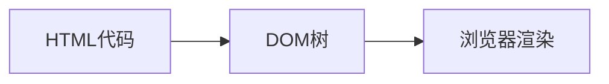
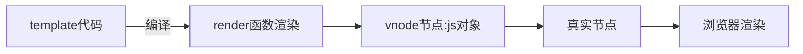

### 一、DOM渲染

#### 1.1 真实的DOM渲染

在传统的前端开发中，是编写自己的HTML，最终被渲染到浏览器上的，流程如下：



#### 1.2 虚拟DOM的优势

目前框架都会引入虚拟DOM来对真实的DOM进行抽象，这样做有很多的好处：

- 首先是可以对真实的元素节点进行抽象，抽象成VNode（虚拟节点），这样方便后续对其进行各种操作：
  - 因为对于直接操作DOM来说是有很多的限制的，比如diff、clone等等，但是使用JavaScript编程语言来操作这些，就变得非常的简单
  - 我们可以使用JavaScript来表达非常多的逻辑，而对于DOM本身来说是非常不方便的
- 其次是方便实现跨平台，包括你可以将VNode节点渲染成任意你想要的节点：
  - 如渲染在canvas、WebGL、SSR、Native（iOS、Android）上
  - 并且Vue允许你开发属于自己的渲染器（renderer），在其他的平台上渲染

#### 1.3 虚拟DOM的渲染过程



### 二、vue三大核心系统

Vue的源码包含三大核心：

- Compiler模块：编译模板系统
- Runtime模块：也可以称之为Renderer模块，真正渲染的模块
- Reactivity模块：响应式系统

#### 2.1 实现Mini-Vue

这里我们实现一个简洁版的Mini-Vue框架，该Vue包括三个模块：

- 渲染系统模块
- 可响应式系统模块
- 应用程序入口模块

#### 2.2 渲染系统实现

渲染系统，该模块主要包含三个功能：

- 功能一：h函数，用于返回一个VNode对象
- 功能二：mount函数，用于将VNode挂载到DOM上
- 功能三：patch函数，用于对两个VNode进行对比，决定如何处理新的VNode

h函数：

- h函数的实现：

  - 直接返回一个VNode对象即可

    ```javascript
    //renderer.js
    const h = (tag, props, children) => {
        return {
            tag,
            props,
            children
        }
    }
    ```

Mount函数– 挂载VNode：

- mount函数的实现：

  - 第一步：根据tag，创建HTML元素，并且存储到vnode的el中
  - 第二步：处理props属性
  
    - 如果以on开头，那么监听事件
  
    - 普通属性直接通过 setAttribute 添加即可
  - 第三步：处理子节点
      - 如果是字符串节点，那么直接设置textContent
      - 如果是数组节点，那么遍历调用 mount 函数
  
  ```javascript
  //renderer.js
  const mount = (vnode, container) => {
      const el = vnode.el = document.createElement(vnode.tag);
      if(vnode.props) {
          for(const key in vnode.props) {
              const value = vnode.props[key];
              if(key.startswith("on")) {
                  el.addEventListener(key.slice(2).toLowerCase(), value);
              } else {
                  el.setAttribute(key, value);
              }
          }
      } 
      if(vnode.children) {
          if(typeof vnode.children === 'string') {
              el.textContent = vnode.children;
          } else {
              vnode.children.forEach(child => {
                  mount(child, el);
              })
          }
      }
      container.appendChild(el);
  }
  ```

Patch函数– 对比两个VNode：

patch函数的实现，分为两种情况：

- n1和n2是不同类型的节点：
  - 找到n1的el父节点，删除原来的n1节点的el
  - 挂载n2节点到n1的el父节点上；
- n1和n2节点是相同的节点：
  - 处理props的情况：
    - 先将新节点的props全部挂载到el上
    - 判断旧节点的props是否不需要在新节点上，如果不需要，那么删除对应的属性
  - 处理children的情况：
    - 如果新节点是一个字符串类型，那么直接调用 `el.textContent = newChildren`
    - 如果新节点不同一个字符串类型：
      - 旧节点是一个字符串类型：
        - 将el的textContent设置为空字符串
        - 旧节点是一个字符串类型，那么直接遍历新节点，挂载到el上
      - 旧节点也是一个数组类型：
        - 取出数组的最小长度
        - 遍历所有的节点，新节点和旧节点进行path操作
        - 如果新节点的length更长，那么剩余的新节点进行挂载操作
        - 如果旧节点的length更长，那么剩余的旧节点进行卸载操作

代码实现：

```javascript
//renderer.js
const patch = (n1, n2) => {
    if(n1.tag !== n2.tag) { //如果n1和n2标签不一样直接替换
        const n1ElParent = n1.el.parentElement;
        n1ElParent.removeChild(n1.el);
        mount(n2, n1ElParent);
    } else {
        //1.取出element对象并n2中保存
        const el = n2.el = n1.el;
        
        //2.处理props
        const oldProps = n1.props || {};
        const newProps = n2.props || {};
        //2.1获取所有的newProps添加到el
        for(const key in newProps) {
            const oldValue = oldProps[key];
            const newValue = newProps[key];
            if(newValue !== olaValue) {
                if(key.startsWith("on")) { //判断属性是否为事件
                    el.addEventListener(key.slice(2).toLowerCase(), newValue)
                } else {
                    el.setAttribute(key, newValue);
                }
            }
        }
        
        //2.2删除旧的props
        for(const key in oldProps) {
            //由于function是引用类型,所以上面新旧属性对比时就算函数体一样结果都为false
            //所以旧的事件都需要移除,否则会有多个重复的函数执行
            if(key.startsWith("on")) { //判断属性是否为事件
                    const value = oldProps[key];
                    el.removeEventListener(key.slice(2).toLowerCase(),value);
                }
            if(!(key in newProps)) {
                    el.removeAttribute(key);
            }
        }
        
        //3.处理children
        const oldChildren = n1.children || [];
        const newChildren = n2.children || [];
        
        if(typeof newChildren === "string") { //情况一：如果新的子元素是string
            //边界情况
            if(typeof oldChildren === "string") {
                if(newChildren !== oldChildren) {
                    el.textContent = newChildren;
                }
            } else {
                el.innerHTML = newChildren;
            }
        } else { //情况二：新的子元素是array
            if(typeof oldChildren === "string") {
                el.innerHTML = "";
                newChildren.forEach(child => {
                    mount(child, el);
                });
            } else {
                //1.前面有相同节点的原生进行patch操作
                const commonLength = Math.min(oldChildren.length, newChildren.length);
                for(let i = 0; i < commonLength; i++) {
                    //递归调用patch方法比较新旧子节点
                    patch(oldChildren[i], newChildren[i]);
                }
                
                //2.如果新子节点比旧子节点多，直接将commonLength后的节点挂载到el上
                if(newChildren.length > commonLength) {
                    newChildren.slice(commonLength).forEach(child => {
                        mount(child, el);
                    })
                } else if(oldChildren.length > commonLength) { 
                    //3.如果旧子节点比新子节点多，卸载commonLength后的子节点
                    oldChildren.slice(commonLength).forEach(child => {
                        el.removeChild(child.el)
                        //注意移除子节点需传入真实节点，所以需要传入vnode对其真实节点的引用el
                    })
                }
            }
        }
    }
}
```

#### 2.3 响应式系统实现

- 响应式思想

  响应式思想就是如果依赖发生变化，那么就应该重新执行一次更新结果

  ```javascript
  const info = {counter: 100};
  
  const doubleCounter = () => {
      console.log(info.counter * 2);
  }
  doubleCounter();
  //依赖开始更新
  info.counter++;
  //此时doubleCounter应该重新执行更新结果
  ```

- 响应式系统简陋实现

  要实现响应式系统，就要新建一个依赖收集类：

  ```javascript
  class Dep {
      constructor() {
          this.subscribers = new Set();
      }
      
      addEffect(effect) { //添加副作用
          this.subscribers.add(effect);
      }
      
      notify() { //通知副作用更新
          this.subscribers.forEach(effect => {
              effect();
          })
      }
  }
  
  
  const info = {counter: 100};
  
  const dep = new Dep();
  const doubleCounter = () => {
      console.log(info.counter * 2);
  }
  //添加副作用
  dep.addEffect(doubleCounter);
  
  //依赖更新
  info.counter++;
  
  //此时应该通知副作用更新
  dep.notify();
  ```

- 添加effect重构

  ```javascript
  //去除addEffect，换成watchEffect
  class Dep {
      constructor() {
          this.subscribers = new Set();
      }
      
      depend() {
          if(activeEffect) {
              this.subscribers.add(activeEffect);
          } 
      }
      
      notify() { //通知副作用更新
          this.subscribers.forEach(effect => {
              effect();
          })
      }
  }
  
  let info = {counter: 100};
  const dep = new Dep();
  
  let activeEffect = null;
  function watchEffect(effect) {
      activeEffect = effect;
      dep.depend();
      effect(); //watchEffect会先执行一次函数
      activeEffect = null;
  }
  
  watchEffect(function() {
      console.log(info.counter * 2); //副作用会自动注册并调用
  })
  //依赖更新
  info.counter++;
  dep.notify();
  ```

  但这个实现有非常多问题，首先是同一对象不同key依赖：

  ```javascript
  const info = {
      counter: 100,
      height: 1.88
  }
  
  watchEffect(function() {
      console.log(info.counter * 2);
  });
  watchEffect(function() {
      console.log(info.height + 1);
  })
  
  //counter更新
  info.counter++;
  notify(); //但在notify的时候也会将依赖height的副作用函数唤醒执行
  ```

  其次是对不同对象的依赖：

  ```javascript
  const info = {
      counter: 100,
      height: 1.88
  };
  const user = {
      name: "coderwhy"
  }
  
  watchEffect(function() {
      console.log(info.counter * 2);
  });
  watchEffect(function() {
      console.log(user.name);
  })
  
  //user变更
  user.name = "Lilei";
  notify(); //此时notify不仅会将依赖user的副作用函数唤醒，还会将依赖info的副作用函数唤醒
  
  ```

  所以应该根据不同对象设置不同的依赖存储结构，同一对象还应根据不同键设置不同依赖存储结构

#### 2.4 响应式系统Vue2实现

在vue2响应式系统中，新建一个reactiveAPI实现依赖收集分装：

```javascript
function reactive(raw) {
    Object.keys(raw).forEach(key => {
        const dep = getDep(raw, key); //将具体对象的具体键的依赖储存结构取出
        let value = raw[key]; //将值取出
        
        Object.defineProperty(raw, key, {
            get() {
                dep.depend(); //在使用到响应式对象的键时，将函数收集到依赖系统中
                return value; //返回值
            },
            set(newValue) {
                if(value !== newValue) { //新旧值不一致时才更新并且唤醒副作用函数
                    //此处不能直接设置raw[key] = value,这样会递归调用set方法
                    //应该修改value,由于get方法返回的是value,所以值最终会被更新
                    value = newValue; 
                    dep.notify();
                }
            }
        })
    })
    return raw;
}
```

具体依赖收集分装结构实现：

```javascript
//总的依赖结构，以对象为键维护每个对象的依赖结构
//当对象被回收时同时回收对应的依赖结构
const targetMap = new WeakMap(); 
function getDep(target, key) {
    let depsMap = targetMap.get(target); //根据对象取出对应依赖结构
    if(!depsMap) { //如果还没有创建则新创建一个
        depsMap = new Map();
        targetMap.set(target, depsMap);
    }
    //根据key从depsMap中取出对应dep对象
    let dep = depsMap.get(key);
    if(!dep) { //如果还没创建则新创建一个
        dep = new Dep();
        depsMap.set(key, dep);
    }
    return dep;
}
```

dep及watchEffect实现：

```javascript
class Dep {
    constructor() {
        this.subscribers = new Set();
    }
    
    depend() {
        if(activeEffect) {
            this.subscribers.add(activeEffect);
        }
    }
    
    notify() {
        this.subscribers.forEach(effect => {
            effect();
        })
    }
}

let activeEffect = null; //初始化activeEffect
function watchEffect(effect) {
    activeEffect = effect;
    effect();
    activeEffect = null;
}
```

#### 2.5 响应式系统Vue3实现

Vue3的响应式系统实现是通过proxy而非defineProperty来实现的，为什么Vue3选择Proxy呢

- Object.definedProperty 是劫持对象的属性时，如果新增元素，那么Vue2需要再次调用definedProperty，而 Proxy 劫持的是整个对象，不需要做特殊处理
- 修改对象的不同：
  - 使用 defineProperty 时，我们修改原来的 obj对象就可以触发拦截
  - 而使用 proxy，就必须修改代理对象，即 Proxy 的实例才可以触发拦截
- Proxy 能观察的类型比 defineProperty 更丰富：
  - has：in操作符的捕获器
  - deleteProperty：delete 操作符的捕捉器
  - 等等其他操作
- Proxy 作为新标准将受到浏览器厂商重点持续的性能优化
- 缺点：Proxy 不兼容IE，也没有 polyfill,defineProperty 能支持到IE9

代码实现：

```javascript
function reactive(raw) {
    return new Proxy(raw, {
        get(target, key) {
            //由于方法外部没有key,所以获取依赖结构必须放进方法内部
            const dep = getDep(target, key);
            dep.depend();
            //由于get方法是对代理对象劫持,所以可以直接返回原对象数据
            return target[key]; 
        }
        set(target, key, value) {
        	const dep = getDep(target, key);
        	if(value !== target[key]) {
                target[key] = value;
                notify();
                return true;
            }
    	}
    })
}
```

#### 2.6 Mini-Vue实现

```html
//index.html
<!DOCTYPE html>
<html lang="en">
<head>
  <meta charset="UTF-8">
  <meta http-equiv="X-UA-Compatible" content="IE=edge">
  <meta name="viewport" content="width=device-width, initial-scale=1.0">
  <title>Document</title>
</head>
<body>
  
  <div id="app"></div>
  <script src="../02_渲染器实现/renderer.js"></script>
  <script src="../03_响应式系统/reactive.js"></script>
  <script src="./index.js"></script>

  <script>
    // 1.创建根组件
    const App = {
      data: reactive({
        counter: 0
      }),
      render() {
        return h("div", null, [
          h("h2", null, `当前计数: ${this.data.counter}`),
          h("button", {
            //必须用箭头函数才能获取外层this
            onClick: () => {
              this.data.counter++
              console.log(this.data.counter);
            }
          }, "+1")
        ])
      }
    }

    // 2.挂载根组件
    const app = createApp(App);
    app.mount("#app");
  </script>

</body>
</html>
```

```javascript
//index.js
function createApp(rootComponent) {
  return {
    mount(selector) {
      const container = document.querySelector(selector);
      let isMounted = false;//挂载标志,默认为false,执行一次mount之后立即设为true
      let oldVNode = null;

      watchEffect(function() { //通过添加到watchEffect进行响应式收集渲染
        if (!isMounted) { //当节点未挂载时应生成虚拟节点节点并挂载
          oldVNode = rootComponent.render(); //通过oldNode保持对虚拟节点引用
          mount(oldVNode, container);
          isMounted = true;
        } else { //当节点已挂载时应生成新的虚拟节点并进行patch
          const newVNode = rootComponent.render();
          patch(oldVNode, newVNode);
          oldVNode = newVNode; //更新虚拟节点引用
        }
      })
    }
  }
}
```

